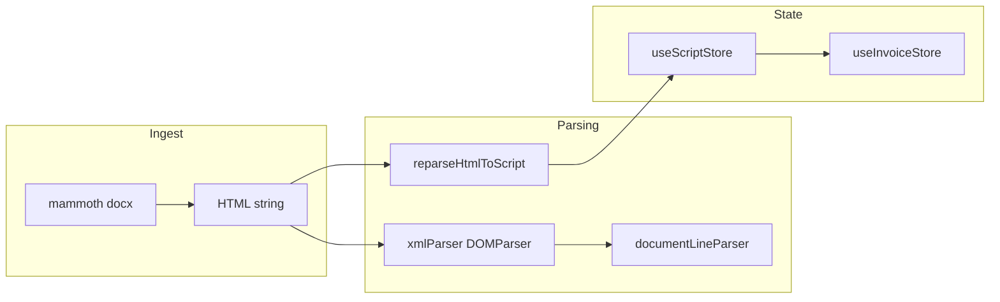

# Codebase audit: React, performance, parsing, and tests

## Executive summary

The app is a **Vite + React 19 + Mantine v8 + Zustand + TipTap** stack with a focused **script parsing → word counts → invoice** pipeline. Structure is generally clear (feature folders, typed `Script` models, Vitest for parsers/store). The main issues cluster into **three real bugs** (one in [`UploadDocumentsOverview.tsx`](src/features/editor/components/UploadDocumentsOverview.tsx), one in [`Scripts.tsx`](src/features/editor/components/Scripts.tsx), one block of **dead UI** in the same file), **subscription/re-render cost** in invoice/editor integration, **expensive equality checks** in the script store, **HTML generation safety** in [`formatParsedLines.ts`](src/features/editor/utils/formatParsedLines.ts), and **CI-level TypeScript errors** on `Box` + `radius` across several pages (Mantine v8 typing/API mismatch). Tests cover parsers and the script store well but **omit components** and **miss the `scripts.map` dependency bug**.

---

## Critical / high-severity issues

### 1. Incorrect `useEffect` dependency: `[scripts.map]` (bug)

**Where:** [`UploadDocumentsOverview.tsx`](src/features/editor/components/UploadDocumentsOverview.tsx) lines 68–70.

**Problem:** The dependency array uses `scripts.map`, which is the **Array.prototype.map function reference** (stable), not the list of script IDs. The effect does **not** re-run when scripts are added/removed/changed as intended. Selection sync on new uploads is unreliable.

**Fix:** Depend on a **serialized identity** of script IDs, e.g. `scripts.map((s) => s.id).join("\0")` or `useMemo(() => scripts.map(s => s.id).join("|"), [scripts])`, or compare previous vs current id list in the effect. Add a test that mounts with scripts A,B, then changes to A,B,C and asserts selection updates.

### 2. `useEffect` comment contradicts code: “clear editing when active script changes”

**Where:** [`Scripts.tsx`](src/features/editor/components/Scripts.tsx) lines 80–83.

**Problem:** Effect runs **once on mount** (`[]`) but the comment says it should clear editing when the active script changes. Switching tabs while “editing” can leave `editingScriptId` pointing at a non-active script (or stale state).

**Fix:** Use `useEffect(() => { setEditingScriptId(null); }, [activeScriptId]);` (and remove the misleading block or merge with other selection logic if needed).

### 3. Dead UI: “Getting Started” tab never renders in the script header

**Where:** [`Scripts.tsx`](src/features/editor/components/Scripts.tsx) — outer block is `{hasScripts && (` (line 142); inner block is `{!hasScripts && (` (lines 153–181).

**Problem:** The inner branch is **logically unreachable**. Likely a copy-paste or refactor error.

**Fix:** Remove the dead branch, or restructure so when scripts exist the user can still open a “new upload / getting started” view (if that is the product intent). Align UX with design.

### 4. TypeScript build failures (`tsc`)

**Evidence:** `npx tsc --noEmit` reports errors: **`Box` does not accept `radius`** in multiple files ([`InvoiceDetailsSection.tsx`](src/features/invoice/details/InvoiceDetailsSection.tsx), [`InvoiceItemAdder.tsx`](src/features/invoice/items/InvoiceItemAdder.tsx), [`ProfileSection.tsx`](src/features/invoice/profile/ProfileSection.tsx), [`Authentication.tsx`](src/pages/Authentication.tsx), [`Dashboard.tsx`](src/pages/Dashboard.tsx), [`Profile.tsx`](src/pages/Profile.tsx)), plus **unused `Paper` import** in [`InvoiceSummary.tsx`](src/features/invoice/summary/InvoiceSummary.tsx).

**Fix:** Use Mantine-supported API: e.g. `Paper`/`Card` for rounded containers, or `style={{ borderRadius: 'var(--mantine-radius-md)' }}`, or the correct v8 prop if documented. Remove unused imports. Goal: **`pnpm exec tsc --noEmit` (or `npm run build`) passes**.

---

## Performance and React patterns

### 5. Broad Zustand subscriptions

**Where:** `useInvoiceStore()` without a selector in [`InvoicePage.tsx`](src/features/invoice/pages/InvoicePage.tsx), [`InvoiceSummary.tsx`](src/features/invoice/summary/InvoiceSummary.tsx), [`UploadDocumentsOverview.tsx`](src/features/editor/components/UploadDocumentsOverview.tsx), and partial destructuring in [`Scripts.tsx`](src/features/editor/components/Scripts.tsx).

**Problem:** Subscribing to the **entire store** causes re-renders on any invoice mutation, even when a subtree only needs `items` or actions.

**Fix:** Use atomic selectors, e.g. `useInvoiceStore((s) => s.invoice.items)`, `useInvoiceStore((s) => s.addSubitemsToItem)`, or `useShallow` from `zustand/react/shallow` when selecting multiple fields. Keeps [`InvoiceSummary`](src/features/invoice/summary/InvoiceSummary.tsx) `memo` meaningful.

### 6. `updateScriptFromHtml` equality: `JSON.stringify(lines)`

**Where:** [`scriptEditorStore.ts`](src/features/editor/store/scriptEditorStore.ts) lines 74–78.

**Problem:** On every debounced reparse (500ms while editing), stringifying the full `lines` array is **O(n)** and allocates. Large scripts amplify cost.

**Fix:** Compare cheaper signals first (e.g. `overview.wordCount`, `lines.length`, hash of dialogue indices), or maintain a **revision counter** when parsing runs, or shallow-compare **line ids + types** only if structure is stable.

### 7. TipTap: `shouldRerenderOnTransaction: true`

**Where:** [`TextEditor.tsx`](src/features/editor/components/TextEditor.tsx) line 27.

**Problem:** Forces React re-renders on **every transaction** (e.g. each keystroke). Fine for tiny docs; painful for large scripts.

**Fix:** Set to `false` if Mantine `RichTextEditor` still works, or gate toolbar updates differently; profile with React Profiler on a long script.

### 8. `ScriptEditor` debounce fires on every `script.html` change

**Where:** [`ScriptEditor.tsx`](src/features/editor/components/ScriptEditor.tsx) effect deps include `script.html`.

**Problem:** Expected while typing, but any upstream store churn will reset timers. Usually acceptable; if profiling shows jank, debounce in a ref or move parse to `requestIdleCallback` for very large HTML.

---

## Parsing and data-model issues

### 9. Naming: `xmlParser` parses HTML

**Where:** [`xmlParser.ts`](src/features/editor/utils/xmlParser.ts).

**Problem:** Misleading name for onboarding and reviews.

**Fix:** Rename to `parseHtmlToDocument` (or similar) and update imports; keep a thin deprecated alias if needed.

### 10. No handling of `DOMParser` parse errors

**Problem:** Invalid HTML can yield a `parsererror` document; code rarely checks [`document.querySelector("parsererror")`](https://developer.mozilla.org/en-US/docs/Web/API/DOMParser).

**Fix:** After `parseFromString`, detect parser error nodes and surface a user-visible error or fallback.

### 11. `reparseHtmlToScript` vs `processDocuments` node mismatch

**Where:** [`documentParser.ts`](src/features/editor/utils/documentParser.ts) — `querySelectorAll("p, h3")` vs paragraph-only in `processDocuments`.

**Problem:** **Editor round-trip** and **DOCX import** can classify lines differently (e.g. markers in `h3` only on reparse).

**Fix:** Unify extraction (shared helper: list of block nodes to walk) and add tests that DOCX-only and editor-only paths produce consistent `ParsedLine` sequences for the same logical script.

### 12. Parentheses / notes extraction

**Where:** `NOTES_PATTERN` and `replace` in [`documentParser.ts`](src/features/editor/utils/documentParser.ts).

**Problem:** Regex-based stripping can mishandle **nested parentheses** or edge cases; tests cover simple cases only.

**Fix:** Document supported formats; add fuzz/edge tests; consider a small lexer if requirements grow.

### 13. HTML generation without escaping (`generateHtmlFromScript`)

**Where:** [`formatParsedLines.ts`](src/features/editor/utils/formatParsedLines.ts).

**Problem:** `line.source` is interpolated into HTML strings. If content ever includes `<`, `&`, or script-like text, you risk **broken markup or XSS** when that HTML is fed back into TipTap/DOM.

**Fix:** Escape text for HTML context (or build DOM with `textContent` and serialize). Add tests for `<script>` and `&` in source lines.

### 14. Script IDs from filenames / indices

**Where:** [`documentParser.ts`](src/features/editor/utils/documentParser.ts) `id: \`${i}-${doc.name}\``.

**Problem:** Duplicate uploads or odd filenames can collide or produce awkward ids; special characters in names appear in ids.

**Fix:** Use `crypto.randomUUID()` (or the project’s existing `generateId` pattern from [`invoiceStore.ts`](src/features/invoice/store/invoiceStore.ts)) for script and line ids; keep display `name` separate.

### 15. `processDocuments` is `async` without `await`

**Where:** [`documentParser.ts`](src/features/editor/utils/documentParser.ts).

**Problem:** Unnecessary async; callers might assume real I/O.

**Fix:** Return `Promise.resolve(parsed)` only if you need async API; otherwise make it synchronous and update call sites.

---

## Tests: gaps and quality

### 16. Store test uses `(updatedScript.lines[0] as any)`

**Where:** [`scriptEditorStore.test.ts`](src/features/editor/store/scriptEditorStore.test.ts).

**Fix:** Narrow with `expect(updatedScript.lines[0]).toSatisfy(...)` or `if (updatedScript.lines[0].type === 'dialogue')` and then assert on `content`.

### 17. Missing regression test for `UploadDocumentsOverview` selection effect

**Fix:** React Testing Library: change `scripts` prop from two ids to three; assert `selectedScriptIds` (or UI reflecting “select all”) updates—this would have caught the `scripts.map` bug.

### 18. No component tests for critical flows

**Gaps:** [`Scripts.tsx`](src/features/editor/components/Scripts.tsx) (upload → scripts appear), [`TextEditor`](src/features/editor/components/TextEditor.tsx) content sync, paste flow in [`GettingStarted`](src/features/editor/components/GettingStarted.tsx).

**Fix:** Add a small RTL suite for the highest-value user paths; keep unit tests for pure parsers.

### 19. Parser tests are strong for happy paths

**Where:** [`documentParser.test.ts`](src/features/editor/utils/documentParser.test.ts), etc.

**Suggestion:** Add cases for **empty `
`**, **only whitespace nodes**, and **mixed `h3`/`p`** matching production HTML from mammoth.

---

## Security, auth, and product consistency

### 20. Route protection asymmetry

**Where:** [`router.tsx`](src/router.tsx) — `/editor` and `/invoice` are **not** under `authenticatedRoutes`; `/dashboard` and `/profile` require login.

**Problem:** May be intentional (guest workflow) or oversight.

**Fix:** Decide product rules; if editor/invoice should require auth, nest routes or duplicate `beforeLoad` guards.

### 21. `userStore`: simulated login and `getIsLoggedIn`

**Where:** [`userStore.tsx`](src/store/userStore.tsx).

**Notes:** `simulateLogin` ships in client code; `getIsLoggedIn` exists on the store object but **is not declared on `UserState`** (type drift risk). `partialize` strips `email` from persisted user—confirm whether **email should survive refresh**.

**Fix:** Align types with implementation; replace mock with real API when ready; document persistence shape.

---

## UX / accessibility (minor but visible)

### 22. `alert()` for paste validation

**Where:** [`Scripts.tsx`](src/features/editor/components/Scripts.tsx).

**Fix:** Mantine notifications or inline `Alert` for consistent UI.

### 23. Table row keys when `line.id` missing

**Where:** [`ScriptOverview.tsx`](src/features/editor/components/ScriptOverview.tsx) line 295.

**Problem:** Fallback `line-${index}-${line.type}` can **reuse keys** when filtering changes order/content.

**Fix:** Ensure every `ParsedLine` has a stable `id` after parse (already mostly true); avoid index-based keys as primary.

---

## Positive observations (keep doing this)

- **Cancellation** in [`Scripts.tsx`](src/features/editor/components/Scripts.tsx) `processDocuments` effect (`cancelled` flag) is correct for async work.
- **Debounced reparse** with `shouldUpdateHtml: false` in [`ScriptEditor.tsx`](src/features/editor/components/ScriptEditor.tsx) shows good understanding of TipTap vs derived state.
- **Vitest + jsdom** on parsers/store is the right layer for fast tests.
- [`scriptEditorStore`](src/features/editor/store/scriptEditorStore.ts) `addScripts` dedupes by id.

---

## Suggested priority order

1. Fix **`scripts.map` effect dependency** and **`activeScriptId` editing reset** (user-visible bugs).
2. Fix **`tsc` / Mantine `Box` `radius`** so builds are green.
3. Remove or fix **dead “Getting Started” header** code.
4. Tighten **Zustand selectors** on hot paths (`InvoiceSummary`, `UploadDocumentsOverview`).
5. **Escape HTML** in `generateHtmlFromScript` + tests.
6. Replace **`JSON.stringify` lines** comparison with cheaper strategy.
7. Broaden **tests** (UploadDocumentsOverview, HTML escape, parser error handling).
